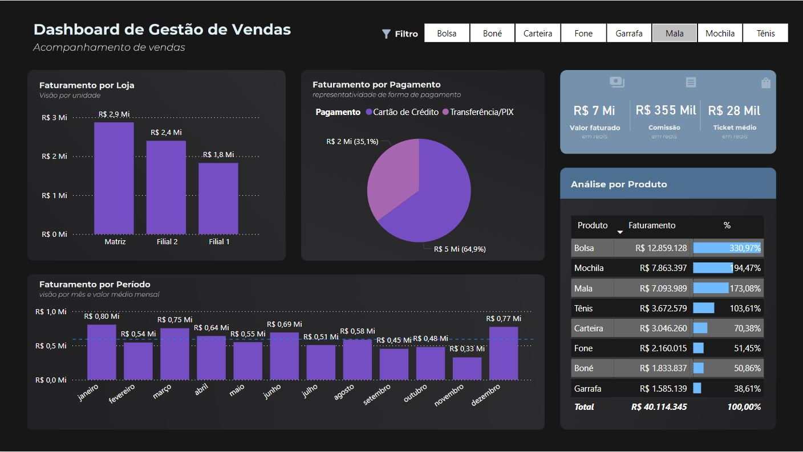

# Dashboard de Gestão de Vendas

Este projeto tem como objetivo analisar o desempenho de vendas de uma rede fictícia de lojas, utilizando dados do Kaggle e construindo um dashboard interativo no Power BI.

## 📌 Sobre o Projeto

O objetivo deste projeto foi analisar o desempenho de vendas de uma rede fictícia de lojas, utilizando dados do Kaggle e criando um dashboard interativo no Power BI.

## ⭐ STAR do Projeto

- **Situação**:  
  Eu estava trabalhando em um projeto que envolvia a análise de vendas de uma rede fictícia de lojas utilizando dados extraídos de um conjunto do Kaggle. A empresa precisava de um painel visual para acompanhar o desempenho de suas lojas e melhorar a tomada de decisões sobre produtos e estratégias de vendas.

- **Tarefa**:  
  Meu objetivo era criar um dashboard interativo no Power BI que permitisse analisar o desempenho das lojas com base em diferentes métricas, como faturamento, formas de pagamento e produtos mais vendidos. O dashboard deveria fornecer insights práticos para a gestão das lojas.

- **Ação**:
  - Importe os dados do Kaggle para o Power BI e realizei um processo de limpeza e tratamento de dados, corrigindo valores nulos e ajustando os tipos de variáveis.
  - Criei métricas e medidas no Power BI para calcular o total de vendas, ticket médio e comissão.
  - Desenvolvi visualizações interativas que permitiram analisar o desempenho por loja, período e forma de pagamento, além de detalhar os produtos mais representativos no faturamento.
  - Integrei filtros interativos para que os usuários pudessem segmentar os dados conforme necessário.

- **Resultado**:
  - O dashboard proporcionou uma análise clara do desempenho das lojas, com destaque para o maior faturamento de uma filial (R$ 2,9 milhões).
  - Os gestores conseguiram identificar que o cartão de crédito representava 64,9% das vendas, o que levou a ajustes nas estratégias de pagamento.
  - A visualização dos produtos mais impactantes no faturamento ajudou a identificar o crescimento de 330,97% nas vendas de bolsas.
  - O projeto facilitou a análise de dados e apoiou decisões estratégicas que impactaram diretamente no aumento do faturamento de janeiro, que foi de R$ 800 mil.

## 📊 Contexto

Os dados abrangem pedidos realizados em três filiais, com informações como:

- **ID do Pedido**
- **Data do Pedido**
- **Código da Loja**
- **Produto**
- **Quantidade**
- **Preço Unitário**
- **Forma de Pagamento**
- **Valor da Venda**

Além disso, há uma tabela com detalhes das filiais:

- **Código da Loja**
- **Nome da Loja**
- **Cidade**
- **UF**

## 🔍 Etapas do Projeto

### 1. Importação e Limpeza dos Dados

- Utilização do Power BI para importar os conjuntos de dados.
- Tratamento de dados nulos e ajuste de tipos de variáveis.

### 2. Criação de Métricas e Medidas

- Cálculo do valor total das vendas, ticket médio e comissão.

### 3. Desenvolvimento do Dashboard

- **Faturamento por Loja**: Criação de um gráfico de barras para comparar as vendas entre as lojas.
- **Faturamento por Período**: Adição de um gráfico de linhas para mostrar a evolução do faturamento mensal.
- **Formas de Pagamento**: Visualização das porcentagens de diferentes formas de pagamento com gráficos de pizza.

## 📈 Principais Insights

- A matriz foi responsável pelo maior faturamento, com R$ 2,9 milhões.
- O cartão de crédito representou 64,9% das vendas.
- O produto "Bolsa" teve o maior impacto no faturamento, com crescimento de 330,97%.
- O mês de janeiro apresentou o maior volume de vendas, com R$ 800 mil.

## 🚀 Como Executar

1. Baixe o arquivo do Power BI (`dashboard_gestao_vendas.pbix`).
2. Abra no Power BI Desktop.
3. Explore as visualizações interativas para obter insights detalhados.

## ⭐ Conclusão

O Power BI se mostrou uma ferramenta poderosa para centralizar e visualizar métricas de vendas, permitindo uma análise clara do desempenho das lojas e produtos. Esse projeto reforça a importância de dashboards intuitivos e informativos para a tomada de decisões estratégicas.
